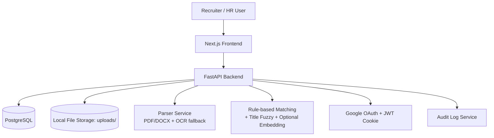
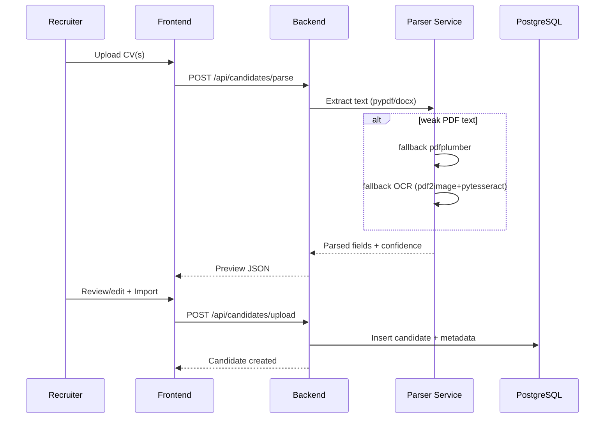
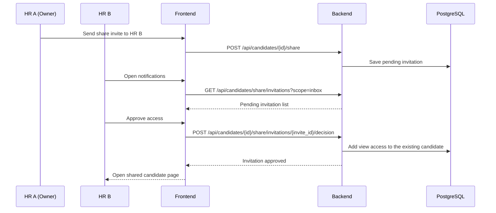
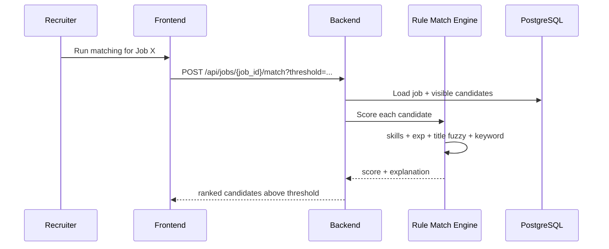
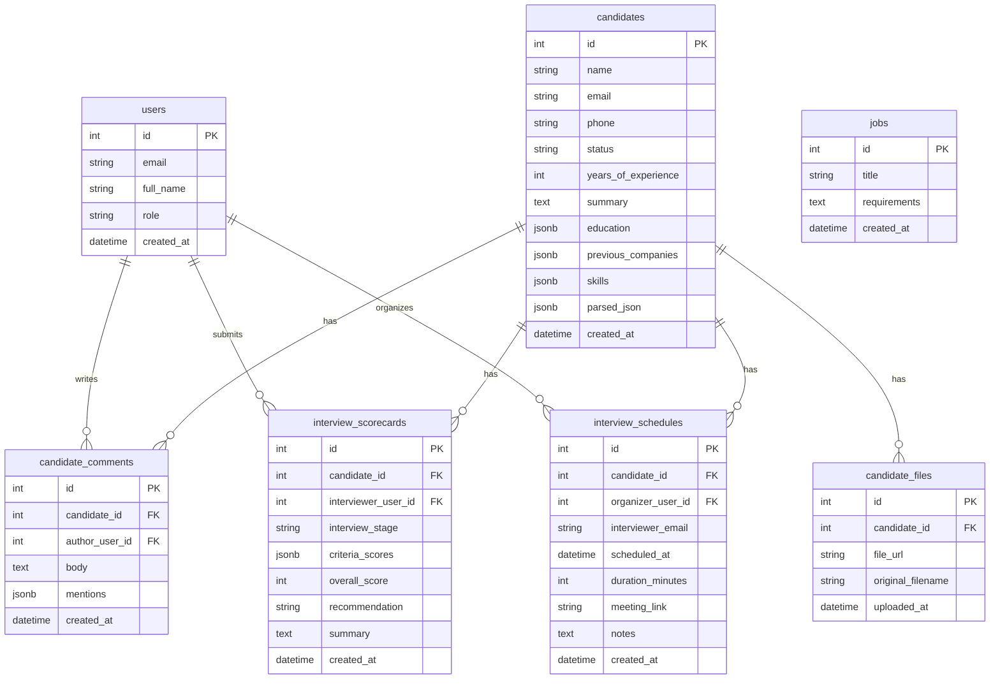

# Mini ATS

A production-oriented **Applicant Tracking System (ATS)** built for recruiter teams.

This project supports end-to-end hiring operations: CV ingestion, parsing, candidate management, collaboration, interview workflow, job matching, automation, analytics, reporting, and role-based access.

## Latest Implementation Updates (September 2026)

- **Recruiter workspace redesigned**:
  - consistent responsive navigation, forms, tables, cards, dialogs, empty states, and dark mode across all pages
  - dashboard is now the default landing page and daily actions are easier to reach
- **Faster CV intake**:
  - drag-and-drop multi-file queue with duplicate filtering and PDF/DOCX validation
  - up to three CVs parse concurrently, with progress and per-file review before import
  - client and API enforce a 20 MB limit per CV
- **Dependency maintenance**:
  - upgraded to Next.js 16.3.7 and verified a zero-vulnerability npm audit
- **Application-centered hiring model**:
  - one candidate can apply to multiple jobs with an independent stage, source, owner, match result, rejection reason, and stage history for each application
  - pipeline, interviews, scorecards, offers, analytics, and reports now use the job application record
- **Public careers flow repaired**:
  - published jobs are available without employee authentication
  - applications require consent and validate email, PDF/DOCX type, duplicate submissions, and the 20 MB limit
- **Organization isolation and database persistence**:
  - candidates, jobs, applications, reports, automation, schedules, audit events, and users are scoped to an organization
  - Alembic migrations replace startup table creation; legacy job settings and application links are migrated
- **Offer workflow added**:
  - draft, approval, sent, accepted, and declined states with hiring manager approval

- **Storage privacy mode added**: `STORAGE_MODE=none` enables metadata-only CV handling (no raw CV file persisted to disk).
- **Email Scheduler upgraded to DB persistence**:
  - scheduled emails now stored in `email_schedules` table (replacing JSON file persistence)
  - manual sender endpoint and UI action added: `Run Due Now` (`POST /api/automation/email/schedules/run-due`)
- **Candidate page email compose flow**:
  - HR can compose interview/rejection emails with editable `To`, `Subject`, `Body`
  - receiver defaults to candidate email but remains editable
- **Candidate profile enhancements**:
  - editable HR fields: Domain tags, Notice period, Preferred location, Experience details
- **Interview scheduling integration**:
  - scheduling an interview now also creates a scheduled email record visible in Automation → Scheduled Emails
- **Permission fix**:
  - recruiters can submit interview scorecards

---

## 1) Business Flows

## 1.1 Candidate Intake & Parsing

1. Recruiter uploads one or multiple CVs (PDF/DOCX).
2. System parses CV into structured profile fields.
3. Recruiter reviews/edits parsed data in parse-first UI.
4. Candidate is imported into ATS with ownership metadata.

### Parsing logic (current)

- Rule-based extraction with EN/VI support.
- Section-aware extraction (skills/experience/education/projects/certifications/languages).
- Confidence output per field + overall confidence score.
- Layered PDF extraction pipeline:
  - pypdf first
  - pdfplumber fallback
  - OCR fallback (pdf2image + pytesseract) for scanned PDFs

---

## 1.2 Candidate Management

- Recruiters manage each job application through ATS stages:
  - applied → screening → interview → offer → hired/rejected
- Soft delete + restore via Trash.
- Candidate detail includes:
  - profile info
  - CV files
  - comments/mentions
  - schedules
  - scorecards
  - timeline

---

## 1.3 Collaboration & Ownership

Ownership-first model:

- Recruiter sees/manages own candidates/jobs by default.
- Shared/invited access supports collaboration.

Current collaboration flows:

1. **Comment mentions**: @mention another HR.
2. **Share invitation**:
   - HR A invites HR B
   - HR B approves/rejects in notifications
   - On approval, the recipient receives a view access record for the same candidate; no duplicate profile is created
3. **Ownership request**:
   - HR can request ownership transfer
   - owner/admin approves/rejects

View-only behavior:

- Non-owner HR (view rights) can see limited candidate page and comment.
- No edit/delete/submit actions unless owner.

---

## 1.4 Job & Matching Flow

1. HR creates a structured job and publishes it when ready.
2. Configure threshold per job.
3. Run matching to get ranked candidates + explanations.
4. Shortlist directly from match result.

Matching evolution:

- **Local rule engine** includes:
  - required skills overlap
  - experience fit
  - title normalization + fuzzy title similarity
  - keyword/context relevance

---

## 1.5 Notifications

- Mention notifications.
- Share invitation inbox.
- Ownership request updates.
- Read-aware badge count (hide when zero).

---

## 1.6 Analytics & Reporting

- Dashboard metrics and funnel views.
- Source effectiveness & conversion metrics.
- Weekly hiring trend, stage aging.
- Export formats: CSV/XLSX/PDF.

---

## 1.7 Auth & Access Control

- Google OAuth login + JWT cookie session.
- Strict auth mode supported.
- Role-based access (admin/recruiter/interviewer/hiring_manager).
- Admin user management + audit logs.

---

## 2) Technical Architecture

## 2.1 Stack

- **Frontend**: Next.js 16 (App Router), React, TypeScript
- **Backend**: FastAPI, SQLAlchemy
- **Database**: PostgreSQL
- **Storage**: Local filesystem (`uploads/`) by default
- **CV parsing and matching**: local rules, skill aliases, dates, and fuzzy title comparison; no API keys or downloaded models

## 2.2 Key Backend Modules

- `app/routers/`:
  - `auth.py`, `users.py`, `audit.py`
  - `candidates.py`, `comments.py`, `jobs.py`
  - `analytics.py`, `reports.py`
  - `automation.py`, `schedules.py`, `scorecards.py`
- `app/services/`:
  - `parser.py` (PDF/DOCX extraction + OCR fallback)
  - `rule_based.py` (parse + matching logic)
  - `cv_fields.py`, `cv_parsing.py`, `storage.py`, `audit.py`, `automation.py`

## 2.3 Frontend Main Pages

- `/` dashboard
- `/upload` parse-first CV import
- `/candidates/[id]` candidate workspace
- `/jobs` jobs + matching
- `/pipeline` stage pipeline
- `/automation`, `/notifications`, `/users`, `/audit`, `/login`

---

## 3) Database Design (Core Entities)

## users

- `id` (PK)
- `email` (unique)
- `full_name`
- `role` (admin/recruiter/interviewer/hiring_manager)
- `created_at`

## candidates

- `id` (PK)
- `name`, `email`, `phone`
- `status`
- `years_of_experience`
- `summary`
- `education` (JSONB)
- `previous_companies` (JSONB)
- `skills` (JSONB)
- `parsed_json` (JSONB: owner metadata, timeline, collab/share/request state, confidence, etc.)
- `created_at`

## candidate_files

- `id` (PK)
- `candidate_id` (FK candidates)
- `file_url`, `original_filename`, `uploaded_at`

## candidate_comments

- `id` (PK)
- `candidate_id` (FK)
- `author_user_id` (FK users)
- `body`
- `mentions` (JSONB)
- `created_at`

## interview_scorecards

- `id` (PK)
- `candidate_id` (FK)
- `interviewer_user_id` (FK users)
- `interview_stage`
- `criteria_scores` (JSONB)
- `overall_score`, `recommendation`, `summary`, `created_at`

## interview_schedules

- `id` (PK)
- `candidate_id` (FK)
- `organizer_user_id` (FK users)
- `interviewer_email`
- `scheduled_at`, `duration_minutes`
- `meeting_link`, `notes`, `created_at`

## jobs

- `id` (PK)
- `title`
- `requirements`
- `created_at`
- (ownership + settings handled in routers/metadata)

---

## 4) How to Build & Run

## 4.1 Prerequisites

- Python 3.11 or 3.12
- Node.js 20.9+
- PostgreSQL 14+
- (Optional OCR) `tesseract-ocr`, `poppler-utils`

## 4.2 Quick Run (scripts)

The simplest local setup runs the complete stack and creates a local demo admin automatically:

```bash
docker compose up --build
```

Open `http://localhost:3000`. The API is available at `http://localhost:8000`.

For a native setup, run the scripts below from the project root:

From project root:

```bash
./scripts/run_backend.sh
./scripts/run_frontend.sh
# or run both
./scripts/run_all.sh
```

On Windows PowerShell, use two terminals from the project root:

```powershell
# One-time prerequisite when Python 3.12 is not installed
winget install -e --id Python.Python.3.12

# Terminal 1: creates .venv, installs packages, creates SQLite DB, starts API
.\scripts\run_backend.ps1

# Terminal 2: installs frontend packages when needed and starts the UI
.\scripts\run_frontend.ps1
```

The Windows native setup uses SQLite, local demo authentication, and local CV
parsing by default. PostgreSQL, Docker, Google OAuth, and AI keys are not needed.

Useful overrides:

```bash
BACKEND_PORT=8010 FRONTEND_PORT=3002 ./scripts/run_all.sh
MINI_ATS_AUTO_KILL=0 ./scripts/run_all.sh
```

---

## 4.3 Manual Backend Setup

```bash
python -m venv .venv
source .venv/bin/activate
pip install -r backend/requirements.txt
cp backend/.env.example backend/.env
alembic -c backend/alembic.ini upgrade head
uvicorn app.main:app --reload --port 8000 --app-dir backend
```

---

## 4.4 Manual Frontend Setup

```bash
cd frontend
npm install
cp .env.local.example .env.local
npm run dev
```

---

## 4.5 Optional PostgreSQL Setup

SQLite is the default for local development. To use PostgreSQL instead, install
PostgreSQL and update `DATABASE_URL` in `backend/.env`. Docker users can start
only PostgreSQL with:

```bash
docker compose up -d db
```

Apply versioned database migrations before starting the API:

```bash
alembic -c backend/alembic.ini upgrade head
```

`scripts/run_backend.sh` runs this migration command automatically.

Default sample connection in `backend/.env`:

```env
DATABASE_URL=sqlite:///./mini_ats.db
```

---

## 4.6 Important Environment Variables

## Auth

```env
AUTH_JWT_SECRET=change-me
AUTH_ALLOW_DEV_HEADERS=true # use false outside local development
GOOGLE_CLIENT_ID=
GOOGLE_CLIENT_SECRET=
GOOGLE_REDIRECT_URI=http://localhost:8000/api/auth/google/callback
GOOGLE_ALLOWED_DOMAIN=
AUTH_BOOTSTRAP_ADMIN_EMAIL=
```

## Local matching

Scores use skills (45%), experience (20%), title similarity (20%), and keyword
overlap (15%). Explanations show matching skills and gaps for HR to review.
No external services or embedding models are used.

## CV parsing

CV parsing runs entirely locally using document extraction, English/Vietnamese
rules, a skill catalog, employment dates, and optional local OCR. It never calls
an AI provider. OCR is included in the Docker image; native installations need
Tesseract and Poppler for scanned PDFs.

Preferred location and notice period are extracted only when the CV states them.
Blank values mean they were not found; HR can enter them during review. Reviewed
values and structured experience are preserved when importing the profile.

## OCR dependencies (Phase 1 parsing enhancements)

Python packages are in `requirements.txt`.
System tools for OCR are optional and used automatically for PDF pages with too little readable text.

---

## 5) API Surface (high level)

## Candidates

- `POST /api/candidates/parse`
- `POST /api/candidates/upload`
- `GET /api/candidates`
- `GET /api/candidates/{id}`
- `PATCH /api/candidates/{id}`
- `DELETE /api/candidates/{id}`
- `POST /api/candidates/{id}/restore`
- share/invite/ownership/notifications endpoints

## Jobs

- `POST /api/jobs`
- `GET /api/jobs`
- `PATCH /api/jobs/{id}`
- `POST /api/jobs/{id}/match`
- `GET/PATCH /api/jobs/{id}/settings`

## Automation / Analytics / Reports

- `/api/automation/*`
- `/api/analytics/summary`
- `/api/reports/*`

## Auth / Admin

- `/api/auth/*`
- `/api/users/*`
- `/api/audit/*`

---

## 6) Current Product Status

Implemented:

- parse-first multi-CV workflow
- ownership + collaboration controls
- notifications + mentions
- audit logging
- strict auth option with Google OAuth
- EN/VI UX improvements
- upgraded rule-based parsing & matching (Phase 1/2/3)

Planned next:

- model calibration tooling for match weights
- benchmark dataset + automated quality checks
- optional vector store for large-scale semantic retrieval

---

## 7) License & Notes

Internal project for product development. Adapt architecture and security hardening before public production deployment.

## 8) Architecture Diagram


```mermaid
graph TD
  U[Recruiter / HR User] --> FE[Next.js Frontend]
  FE --> API[FastAPI Backend]
  API --> DB[(PostgreSQL)]
  API --> FS[(Local File Storage: uploads/)]

  API --> PARSER[Parser Service
PDF/DOCX + OCR fallback]
  API --> MATCH[Rule-based Matching
+ Title Fuzzy + Optional Embedding]
  API --> AUTH[Google OAuth + JWT Cookie]
  API --> AUDIT[Audit Log Service]
```

## 9) Sequence Diagrams

### 9.1 CV Upload -> Parse -> Import


```mermaid
sequenceDiagram
  participant HR as Recruiter
  participant FE as Frontend
  participant BE as Backend
  participant PS as Parser Service
  participant DB as PostgreSQL

  HR->>FE: Upload CV(s)
  FE->>BE: POST /api/candidates/parse
  BE->>PS: Extract text (pypdf/docx)
  alt weak PDF text
    PS->>PS: fallback pdfplumber
    PS->>PS: fallback OCR (pdf2image+pytesseract)
  end
  PS-->>BE: Parsed fields + confidence
  BE-->>FE: Preview JSON
  HR->>FE: Review/edit + Import
  FE->>BE: POST /api/candidates/upload
  BE->>DB: Insert candidate + metadata
  BE-->>FE: Candidate created
```

### 9.2 Share Invitation and Access Approval


```mermaid
sequenceDiagram
  participant A as HR A (Owner)
  participant B as HR B
  participant FE as Frontend
  participant BE as Backend
  participant DB as PostgreSQL

  A->>FE: Send share invite to HR B
  FE->>BE: POST /api/candidates/{id}/share
  BE->>DB: Save pending invitation

  B->>FE: Open notifications
  FE->>BE: GET /api/candidates/share/invitations?scope=inbox
  BE-->>FE: Pending invitation list

  B->>FE: Approve access
  FE->>BE: POST /api/candidates/{id}/share/invitations/{invite_id}/decision
  BE->>DB: Add view access to the existing candidate
  BE-->>FE: Invitation approved
  FE-->>B: Open shared candidate page
```

### 9.3 Job Matching Run


```mermaid
sequenceDiagram
  participant HR as Recruiter
  participant FE as Frontend
  participant BE as Backend
  participant RM as Rule Match Engine
  participant DB as PostgreSQL

  HR->>FE: Run matching for Job X
  FE->>BE: POST /api/jobs/{job_id}/match?threshold=...
  BE->>DB: Load job + visible candidates
  BE->>RM: Score each candidate
  RM->>RM: skills + exp + title fuzzy + keyword
  RM-->>BE: score + explanation
  BE-->>FE: ranked candidates above threshold
```

## 10) ER Diagram (Core Database)


```mermaid
erDiagram
  users ||--o{ candidate_comments : writes
  users ||--o{ interview_scorecards : submits
  users ||--o{ interview_schedules : organizes

  candidates ||--o{ candidate_files : has
  candidates ||--o{ candidate_comments : has
  candidates ||--o{ interview_scorecards : has
  candidates ||--o{ interview_schedules : has

  users {
    int id PK
    string email
    string full_name
    string role
    datetime created_at
  }

  candidates {
    int id PK
    string name
    string email
    string phone
    string status
    int years_of_experience
    text summary
    jsonb education
    jsonb previous_companies
    jsonb skills
    jsonb parsed_json
    datetime created_at
  }

  candidate_files {
    int id PK
    int candidate_id FK
    string file_url
    string original_filename
    datetime uploaded_at
  }

  candidate_comments {
    int id PK
    int candidate_id FK
    int author_user_id FK
    text body
    jsonb mentions
    datetime created_at
  }

  interview_scorecards {
    int id PK
    int candidate_id FK
    int interviewer_user_id FK
    string interview_stage
    jsonb criteria_scores
    int overall_score
    string recommendation
    text summary
    datetime created_at
  }

  interview_schedules {
    int id PK
    int candidate_id FK
    int organizer_user_id FK
    string interviewer_email
    datetime scheduled_at
    int duration_minutes
    string meeting_link
    text notes
    datetime created_at
  }

  jobs {
    int id PK
    string title
    text requirements
    datetime created_at
  }
```

## 4.7 Lightweight dependency profile

Default install is now kept lean.

Provider SDKs and embedding models are not included. PDF/DOCX extraction and
matching work locally. Python OCR packages are included; Tesseract and Poppler
system tools are needed only for scanned PDFs. Without them, the upload review
shows a warning when too little text can be read.

## Raw CV retention modes

- `STORAGE_MODE=local` (default): save raw CV files under `UPLOAD_DIR`
- `STORAGE_MODE=none` (recommended high-scale privacy mode): do not persist raw CV on app disk; only metadata marker is stored (`suppressed://...`).
